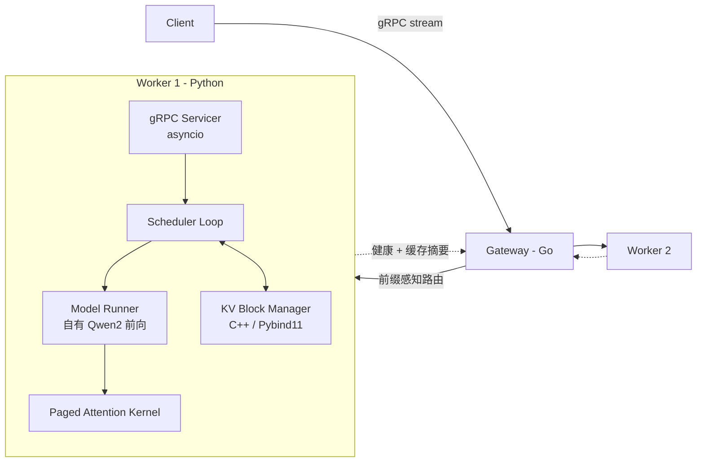
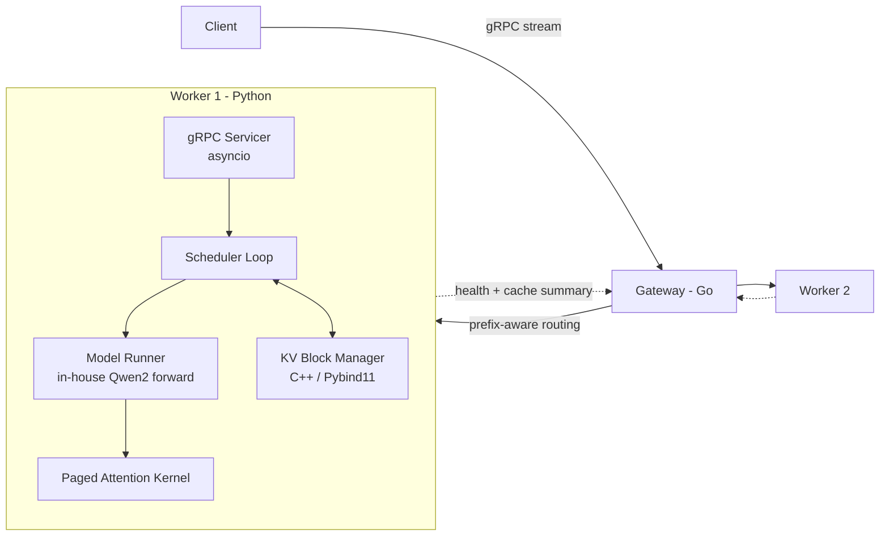

# DistIE：面向 KV-Cache 复用的分布式 LLM 推理引擎

**Project Proposal: DistIE — Distributed Inference Engine with Cache-Aware Scheduling and Routing**

> 状态：进行中（阶段 0–2 已完成，见 §6）｜最后更新：2026-10

---

## 1. 项目目标

构建一个从零实现、可度量的 LLM 推理服务系统，主题是 **KV-Cache 的跨请求复用与跨节点复用**：

- **单节点**：实现 Paged KV-Cache、自有模型前向与 Continuous Batching，使吞吐与延迟显著优于 HuggingFace 原生 `generate`，并能解释与 vLLM 之间的差距来源。
- **跨请求**：通过前缀缓存（Prefix Caching）让共享 system prompt / 多轮对话的请求复用已计算的 KV 块，降低首字延迟（TTFT）。
- **跨节点**：Go Gateway 根据各 Worker 上报的缓存摘要做前缀感知路由，把请求送到"已经算过这段前缀"的 Worker 上。

本项目在本地单卡上开发，正式基准测试与多 Worker 扩展实验在云上多卡环境完成（见 §5.3），所有结论以基准测试数据为准。

## 2. 非目标

为保证范围可控，以下内容明确不做（或仅在主线完成后考虑）：

- 张量并行 / 流水线并行等多卡模型切分（与 KV 复用主题正交；列为主线完成后的可选扩展，见阶段 8）
- 量化、投机解码（Speculative Decoding）
- 鉴权、多租户、会话存储等业务层功能
- 生产级部署（Kubernetes 编排等）

## 3. 系统架构

### 3.1 网关（Gateway — Go）

- **职责**：接入与流式转发、限流（漏桶）、多 Worker 负载均衡、**前缀感知路由**。
- **路由策略**：Worker 通过 `WorkerControl.ReportHealth` 流定期上报负载与缓存摘要（前缀块哈希集合）。Gateway 对请求 prompt 计算同样的块哈希，按「前缀命中长度 − 负载惩罚」打分选择 Worker；无命中时退化为最少负载。
- **为什么用 Go**：Gateway 是 I/O 密集、高并发、需要长连接流式转发的组件，与 SGLang Router、TGI Router 等工业实现的定位一致。

### 3.2 Worker（Python）

- **gRPC Servicer（asyncio）**：只负责 I/O——接收请求、放入等待队列、把生成的 token 流式推回。
- **Scheduler Loop**：独占 GPU 的单一调度循环。每一步：
  1. 准入：等待队列中的请求若能拿到足够的 KV 块则加入运行批次（优先查前缀缓存）；
  2. 抢占：块耗尽时按策略抢占（先实现 recompute，后续可加 swap 到 CPU）；
  3. 构造批次输入：展平的 token、position、每条序列的 block table 与长度；
  4. 前向 + 采样，追加 token，释放已完成序列的块。
- **Model Runner**：自己实现 Qwen2 模型结构（权重从 HuggingFace 加载），attention 层直接读写 Paged KV slab，区分 prefill 与 decode 两条路径。

### 3.3 KV 块管理器（C++）

- **职责**：KV 块的**元数据**管理——分配/释放、引用计数、前缀哈希索引、LRU 淘汰、GPU/CPU 两级存储的换入换出计划。
- **数据面与控制面分离**：K/V 张量本身由 torch 在 GPU（以及 CPU pinned memory）上预分配；C++ 只管理块 ID 及其状态，不持有张量数据，避免每步跨设备拷贝。
- **为什么用 C++**：引用计数、哈希索引、淘汰、写时复制（Copy-on-Write）组合在一起是一个状态复杂、需要强不变式保证的数据结构，适合用 C++ 实现并用 GTest 做细粒度测试。其性能收益将通过与同接口 Python 实现的对比来验证（见 §5），而不是预设。

## 4. 关键设计决策

| 决策        | 选择                                                                                                 | 理由                                                                               |
| --------- | -------------------------------------------------------------------------------------------------- | -------------------------------------------------------------------------------- |
| 注意力计算     | 自有模型前向 + Paged Attention kernel                                                                    | HF 的 attention 只接受稠密 KV，batching 时需每步 gather + padding，抵消分页收益                    |
| Kernel 路线 | 先用 PyTorch 索引实现正确版本，再接入 `flash_attn_with_kvcache`（`block_table`）或 FlashInfer，最后视情况自写 Triton kernel | 先正确再快；每一步都有基准对照                                                                  |
| 调度模型      | 单调度循环独占 GPU，asyncio 仅做 I/O                                                                         | 避免多请求争抢 GPU；分配器无需加锁                                                              |
| 抢占策略      | 先 recompute，后 swap                                                                                 | recompute 实现简单；swap 依赖 CPU 存储层                                                   |
| 前缀缓存粒度    | 以完整块为单位、链式哈希（前缀哈希 + 本块 token）                                                                      | 与 vLLM 方案一致，便于跨 Worker 共享同一哈希空间                                                  |
| 开发环境      | macOS 写无 GPU 组件，WSL2 跑 GPU 组件，统一用类 Unix 构建脚本                                                       | flash-attn、FlashInfer、vLLM 均以 Linux 为主；Go / C++ / 调度逻辑借助 FakeEngine 可在 Mac 上开发测试 |
| 数值精度      | 本地 fp16 / bf16，不做 FP8                                                                              | RTX 3080（Ampere，sm_86）支持 bf16 与 flash-attn 2 / FlashInfer，但不支持 FP8               |

## 5. 评测方案

### 5.1 正确性

- fp32 下贪心解码输出与 HF `generate` **逐 token 一致**；
- fp16 下比较前 N 个 token 的 top-1 一致率与 logits 最大绝对误差；
- 前缀缓存命中与未命中两种路径的输出一致；
- C++ 块管理器：GTest 覆盖引用计数、淘汰、重复释放、耗尽等边界情况。

### 5.2 性能

**负载**

- A：ShareGPT 采样（通用对话，长度分布真实）
- B：合成共享前缀负载（K 个 system prompt × M 个用户问题）
- C：多轮对话（每轮携带完整历史）

**对比对象**

- 下限：HF `generate`（逐请求）
- 本项目各阶段版本（展示每一步的增量）
- 上限：vLLM（同模型、同 GPU、同负载）

**指标**：吞吐（output tok/s）、TTFT p50/p99、TPOT p50/p99、KV 块利用率、前缀命中率、多 Worker 负载均衡度。

所有结果（包括不理想的结果）连同分析记录在 `benchmarks/` 目录。

### 5.3 开发与实验环境

| 环境             | 硬件                            | 用途                                                                   |
| -------------- | ----------------------------- | -------------------------------------------------------------------- |
| macOS          | 无 CUDA                        | Go Gateway、C++ 块管理器、调度逻辑（FakeEngine）的开发与单元测试                          |
| Windows + WSL2 | RTX 3080 Laptop，16 GB 显存      | 模型前向、kernel、正确性测试、日常性能迭代；本地可跑 Qwen2.5-0.5B / 1.5B / 3B，多 Worker 功能联调 |
| 云 GPU（按需租用）    | A100 / H100 / L40S 等，单机 1–8 卡 | 正式基准测试（7B/8B 级模型）、与 vLLM 同环境对比、多 Worker 路由实验、可选的张量并行实验               |

本地数据用于迭代和定位问题；对外报告的结论以云上同环境测得的数据为准，并注明 GPU 型号、驱动、CUDA 与依赖版本。

## 6. 里程碑

### 阶段 0：网关与 RPC 基础 ✅

- Go Gateway：配置、上游 gRPC 客户端、流式转发、漏桶限流（超限返回 `ResourceExhausted`）。
- Protobuf 定义推理服务与 Worker 控制面。

### 阶段 1：块分配与分页 KV 原型 ✅

- C++ `BlockPool` + Pybind11 绑定；`TorchEngine` 以块 ID 为页表，KV 存于预分配 torch slab。
- **已知局限**：仍依赖 HF 前向，每步需 gather/scatter；单请求串行执行。这些将在阶段 3、4 解决。

### 阶段 2：度量基线 ✅

- 清理仓库（移除构建产物与缓存文件）；项目迁入 WSL 文件系统，`.ps1` 脚本替换为 `.sh` / Makefile。
- 正确性测试集与压测脚本（§5），测出当前版本与 HF `generate` 的基线数据。
- **验收**：一条命令产出 TTFT / TPOT / 吞吐报告（`make bench`，默认并发 1）。
- **本地基线**（RTX 3080 Laptop，WSL2，Qwen2.5-1.5B，2026-10-09）：fp32 / fp16 与 HF 贪心逐 token 一致；ShareGPT 200 请求 40.8 output tok/s，TTFT p50 29.6 ms，TPOT p50 23.7 ms。见 `benchmarks/results/baseline-3080.md`。

### 阶段 3：自有模型前向 + Paged Attention

- 实现 Qwen2 前向，attention 直接读写 paged slab，移除 gather/scatter。
- 先 PyTorch 索引版，再接入 paged attention kernel。
- **验收**：通过正确性测试；batch=1 decode 延迟不劣于 HF `generate`。

### 阶段 4：Continuous Batching

- Scheduler Loop：准入、recompute 抢占、prefill/decode 混合批次。
- Servicer 改为纯 I/O，请求通过队列与调度循环交互；支持客户端取消。
- **验收**：负载 A 下吞吐显著高于 HF 基线；在云上与 vLLM 同环境对比，给出差距分析。

### 阶段 5：C++ KV 块管理器

- 在 `BlockPool` 基础上增加引用计数、前缀哈希索引、LRU 淘汰、Copy-on-Write。
- CPU 存储层：pinned memory slab + swap 抢占，C++ 负责生成换入换出计划，Python 执行异步拷贝。
- 同接口 Python 实现作为对照。
- **验收**：负载 B、C 下 TTFT 明显下降；给出 C++ 与 Python 实现的调度开销对比。

### 阶段 6：前缀感知多 Worker 路由

- Worker 经 `ReportHealth` 上报负载与前缀哈希摘要；Gateway 实现打分路由与退化策略。
- 本地在单卡上起多个 Worker 做功能联调；正式实验在云上每卡一个 Worker（4–8 卡）。
- **验收**：多 Worker、负载 B 下，前缀感知路由相比轮询 / 最少负载的命中率与 TTFT 对比。

### 阶段 7：可观测性

- Prometheus 指标：吞吐、TTFT、TPOT、队列长度、KV 利用率、前缀命中率、路由分布。
- Grafana 面板。

### 阶段 8（可选）：张量并行

- 在自有模型前向中按 Megatron 方式切分 attention / MLP，NCCL all-reduce 通信；KV 块管理器按 rank 管理各自的 KV 分片。
- **验收**：云上 2/4 卡运行单卡放不下或吃紧的模型，给出扩展效率与通信开销分析。

## 7. 风险与应对

| 风险                           | 应对                                                |
| ---------------------------- | ------------------------------------------------- |
| Paged attention kernel 开发难度高 | 优先使用 flash-attn / FlashInfer 现成接口，自写 kernel 作为加分项 |
| 笔记本 GPU 性能受功耗与散热影响，数据波动大     | 本地数据只用于迭代；正式结论用云上数据，多次运行取统计值                      |
| 本地与云上环境不一致导致结果不可复现           | 固定依赖版本，提供环境脚本 / Docker 镜像，报告中记录完整环境信息             |
| C++ 块管理器性能收益可能不明显            | 如实报告；其价值同时体现在不变式保证与可测试性上                          |

## 8. 设计修订记录

- **2026-10**：原第二阶段以「Python GC 导致 KV 分配卡顿」为动机引入 C++显存池。复盘后认为块分配频率低（每序列每 16 token 一次），GC 并非瓶颈，且显存实际由 torch 管理。C++ 层职责调整为 KV 块元数据管理（引用计数、前缀缓存、淘汰、两级存储），见 §3.3。
- **2026-10**：发现基于 HF 前向的 gather/scatter 方案无法高效支持 Continuous Batching，将「自有模型前向 + Paged Attention」调整到 batching 之前。
- **2026-10**：移除多线程 C++ Tokenizer（HF tokenizers 已是 Rust 实现）、Redis / JWT（超出项目主题）、LibTorch（模型前向保留在 Python）。项目主题收敛为 KV-Cache 复用。
- **2026-10**：明确实验环境：本地 RTX 3080 Laptop（16 GB）开发，云上多卡做正式基准与扩展实验；张量并行由非目标调整为可选阶段 8。

---

# DistIE: A Distributed LLM Inference Engine for KV-Cache Reuse

**Project Proposal: DistIE — Distributed Inference Engine with Cache-Aware Scheduling and Routing**

> Status: in progress (stages 0–2 complete; see §6) | Last updated: 2026-10

---

## 1. Goals

Build a measurable LLM inference serving system from scratch. The subject is **reusing the KV-Cache across requests and across nodes**:

- **Single node**: implement a Paged KV-Cache, an in-house model forward pass, and Continuous Batching, so that throughput and latency are clearly better than HuggingFace's native `generate`, and so that the gap to vLLM can be explained.
- **Across requests**: Prefix Caching lets requests that share a system prompt or a multi-turn history reuse KV blocks that have already been computed, which lowers time to first token (TTFT).
- **Across nodes**: a Go Gateway routes each request to the Worker that has already computed that prefix, using the cache summaries the Workers report.

Development happens on one local GPU. Official benchmarks and multi-Worker scaling experiments run on multi-GPU cloud machines (see §5.3). Conclusions rest on benchmark numbers.

## 2. Non-goals

The following are out of scope, or are considered only after the main line is done, so the project stays bounded:

- Tensor parallelism, pipeline parallelism, and other ways of splitting one model across GPUs (orthogonal to KV reuse; an optional extension after the main line, see stage 8)
- Quantization and speculative decoding
- Product features such as authentication, multi-tenancy, and session storage
- Production deployment (Kubernetes and similar orchestration)

## 3. Architecture

### 3.1 Gateway (Go)

- **Role**: accept requests and forward the token stream, rate-limit with a leaky bucket, balance load across Workers, and do **prefix-aware routing**.
- **Routing**: each Worker periodically reports load and a cache summary (the set of prefix-block hashes) on the `WorkerControl.ReportHealth` stream. The Gateway hashes the request prompt with the same block hash, then scores Workers by prefix-hit length minus a load penalty. With no hit, it falls back to least load.
- **Why Go**: the Gateway is I/O-bound, highly concurrent, and must forward long-lived streams. That is the same role as industrial routers such as the SGLang Router and the TGI Router.

### 3.2 Worker (Python)

- **gRPC Servicer (asyncio)**: I/O only. It accepts a request, places it on the waiting queue, and streams generated tokens back.
- **Scheduler loop**: one loop that owns the GPU. Each step:
  1. Admission: a waiting request joins the running batch once it can obtain enough KV blocks (prefix-cache lookup first);
  2. Preemption: when blocks run out, preempt by policy (recompute first; swap to CPU can come later);
  3. Build the batch: flattened tokens and positions, plus each sequence's block table and length;
  4. Forward and sample, append the token, and free the blocks of finished sequences.
- **Model Runner**: an in-house Qwen2 implementation (weights loaded from HuggingFace). Attention reads and writes the paged KV slab directly, with separate prefill and decode paths.

### 3.3 KV block manager (C++)

- **Role**: **metadata** for KV blocks — allocate and free, reference counts, a prefix-hash index, LRU eviction, and the plan for moving blocks between GPU and CPU storage.
- **Data plane separate from control plane**: the K and V tensors themselves are preallocated by torch on the GPU (and in CPU pinned memory). C++ tracks block IDs and their state only. It does not hold tensor data, so a step does not copy tensors across devices.
- **Why C++**: reference counting, a hash index, eviction, and copy-on-write together are a stateful structure that needs strong invariants. C++ plus fine-grained GTest fits that. Any speedup is measured against a Python implementation of the same interface (see §5), not assumed up front.

## 4. Design decisions

| Decision | Choice | Reason |
| --- | --- | --- |
| Attention | In-house forward pass + paged attention kernel | HF attention accepts only dense KV. Batching then needs a gather plus padding on every step, which cancels the benefit of paging. |
| Kernel path | A correct PyTorch indexing version first, then `flash_attn_with_kvcache` (`block_table`) or FlashInfer, and a custom Triton kernel only if needed | Correct before fast. Every step has a benchmark to compare against. |
| Scheduling | One scheduler loop owns the GPU; asyncio does I/O only | Requests do not contend for the GPU, and the allocator needs no lock. |
| Preemption | Recompute first, swap later | Recompute is simple to implement. Swap needs the CPU storage tier. |
| Prefix-cache granularity | Whole blocks, with a chained hash (prefix hash + this block's tokens) | Same scheme as vLLM, so Workers can share one hash space. |
| Development environment | macOS for components that need no GPU; WSL2 for GPU components; Unix-style build scripts everywhere | flash-attn, FlashInfer, and vLLM are Linux-first. Gateway, C++, and scheduler logic can be developed and tested on a Mac with FakeEngine. |
| Numeric precision | fp16 / bf16 locally; no FP8 | An RTX 3080 (Ampere, sm_86) supports bf16 and flash-attn 2 / FlashInfer, and does not support FP8. |

## 5. Evaluation

### 5.1 Correctness

- In fp32, greedy decoding matches HF `generate` **token for token**.
- In fp16, compare top-1 agreement over the first N tokens and the maximum absolute logit error.
- Prefix-cache hit and miss paths produce the same output.
- The C++ block manager: GTest covers reference counts, eviction, double free, exhaustion, and similar edges.

### 5.2 Performance

**Workloads**

- A: ShareGPT samples (general chat, realistic length distribution)
- B: synthetic shared-prefix load (K system prompts × M user questions)
- C: multi-turn dialogue (each turn carries the full history)

**Comparisons**

- Floor: HF `generate`, one request at a time
- This project at each stage, so each increment is visible
- Ceiling: vLLM, same model, same GPU, same workload

**Metrics**: throughput (output tok/s), TTFT p50/p99, TPOT p50/p99, KV block utilization, prefix hit rate, and multi-Worker load balance.

Every result, including disappointing ones, is recorded with its analysis under `benchmarks/`.

### 5.3 Development and experiment environments

| Environment | Hardware | Use |
| --- | --- | --- |
| macOS | No CUDA | Develop and unit-test the Go Gateway, the C++ block manager, and scheduler logic (FakeEngine) |
| Windows + WSL2 | RTX 3080 Laptop, 16 GB | Model forward, kernels, correctness tests, day-to-day performance work. Locally this runs Qwen2.5-0.5B / 1.5B / 3B and functional multi-Worker checks. |
| Cloud GPU (rented as needed) | A100 / H100 / L40S and similar, 1–8 GPUs on one machine | Official benchmarks (7B/8B-class models), a same-environment comparison with vLLM, multi-Worker routing experiments, and the optional tensor-parallelism experiment |

Local numbers are for iteration and debugging. Numbers reported externally come from the same cloud environment, and the report names the GPU, driver, CUDA version, and dependency versions.

## 6. Milestones

### Stage 0: Gateway and RPC foundation ✅

- Go Gateway: configuration, upstream gRPC client, streaming forward, leaky-bucket rate limit (over limit returns `ResourceExhausted`).
- Protobuf definitions for the inference service and the Worker control plane.

### Stage 1: Block allocation and paged-KV prototype ✅

- C++ `BlockPool` plus Pybind11 bindings. `TorchEngine` uses block IDs as the page table; KV lives in a preallocated torch slab.
- **Known limits**: the forward pass is still HuggingFace's, so every step gathers and scatters, and requests run one at a time. Stages 3 and 4 remove those limits.

### Stage 2: Measurement baseline ✅

- Clean the repository (drop build outputs and cache files). Move the project onto the WSL filesystem and replace `.ps1` scripts with `.sh` / a Makefile.
- A correctness suite and load scripts (§5), and baseline numbers against HF `generate`.
- **Acceptance**: one command produces a TTFT / TPOT / throughput report (`make bench`, concurrency 1 by default).
- **Local baseline** (RTX 3080 Laptop, WSL2, Qwen2.5-1.5B, 2026-10-09): fp32 and fp16 match HF greedy decoding token for token. ShareGPT, 200 requests: 40.8 output tok/s, TTFT p50 29.6 ms, TPOT p50 23.7 ms. See `benchmarks/results/baseline-3080.md`.

### Stage 3: In-house forward pass + paged attention

- Implement the Qwen2 forward pass so attention reads and writes the paged slab directly, and remove gather/scatter.
- PyTorch indexing first, then a paged attention kernel.
- **Acceptance**: correctness tests pass, and batch=1 decode latency is no worse than HF `generate`.

### Stage 4: Continuous Batching

- Scheduler loop: admission, recompute preemption, and mixed prefill/decode batches.
- The servicer becomes pure I/O. Requests meet the scheduler through a queue. Client cancellation is supported.
- **Acceptance**: under workload A, throughput is clearly above the HF baseline. On the cloud, compare with vLLM in the same environment and explain the gap.

### Stage 5: C++ KV block manager

- On top of `BlockPool`, add reference counts, a prefix-hash index, LRU eviction, and copy-on-write.
- CPU tier: a pinned-memory slab and swap preemption. C++ produces the move plan; Python performs the copies asynchronously.
- A Python implementation of the same interface is the control.
- **Acceptance**: under workloads B and C, TTFT drops clearly. Report scheduler overhead for the C++ and Python implementations.

### Stage 6: Prefix-aware multi-Worker routing

- Workers report load and a prefix-hash summary through `ReportHealth`. The Gateway implements scored routing and the fallback.
- Locally, run several Workers on one GPU for a functional check. The official experiment puts one Worker on each cloud GPU (4–8 GPUs).
- **Acceptance**: with multiple Workers and workload B, compare prefix-aware routing against round-robin and least-load on hit rate and TTFT.

### Stage 7: Observability

- Prometheus metrics: throughput, TTFT, TPOT, queue length, KV utilization, prefix hit rate, routing distribution.
- A Grafana dashboard.

### Stage 8 (optional): Tensor parallelism

- Split attention and the MLP in the in-house forward pass in the Megatron style, with NCCL all-reduce. The KV block manager keeps each rank's KV shard.
- **Acceptance**: on 2 or 4 cloud GPUs, run a model that does not fit, or fits tightly, on one GPU, and report scaling efficiency and communication cost.

## 7. Risks and responses

| Risk | Response |
| --- | --- |
| A paged attention kernel is hard to write | Prefer the existing flash-attn / FlashInfer interfaces. A kernel written in-house is extra credit. |
| Laptop GPU numbers move around with power and thermals | Local numbers are for iteration only. Official conclusions use cloud data, and several runs, so the statistic is stable. |
| Local and cloud environments differ, so results do not reproduce | Pin dependency versions, ship an environment script or Docker image, and record the full environment in the report. |
| The C++ block manager may not be much faster | Report that honestly. Its value is also the invariants and the testability. |

## 8. Design revisions

- **2026-10**: Stage 2 originally motivated a C++ memory pool by "Python GC stalls KV allocation." On review, a block is allocated about once per 16 tokens per sequence, so allocation is rare, GC is not the bottleneck, and the bytes are owned by torch anyway. The C++ layer now manages KV-block metadata (reference counts, prefix cache, eviction, two-tier storage). See §3.3.
- **2026-10**: A gather/scatter path on top of the HF forward pass cannot support Continuous Batching efficiently. "In-house forward pass + paged attention" was moved ahead of batching.
- **2026-10**: Dropped a multi-threaded C++ tokenizer (HF tokenizers is already Rust), Redis / JWT (outside the subject), and LibTorch (the forward pass stays in Python). The subject narrowed to KV-Cache reuse.
- **2026-10**: Environments made explicit: develop on a local RTX 3080 Laptop (16 GB); official benchmarks and scaling experiments run on multi-GPU cloud machines. Tensor parallelism moved from a non-goal to optional stage 8.

